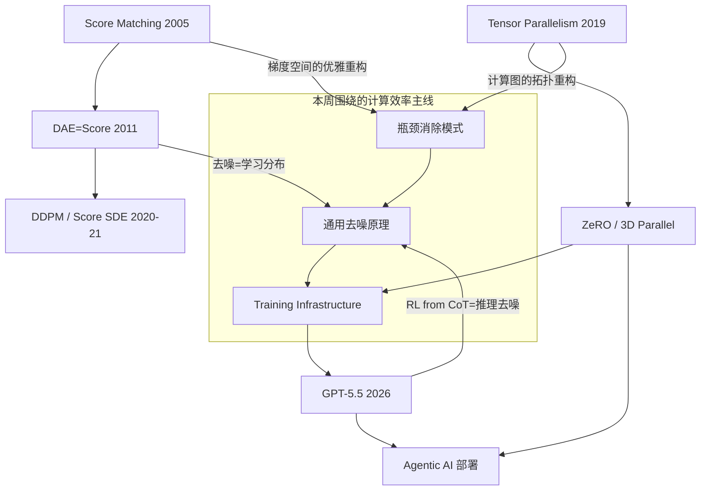

# Cross-Domain Summary — Week 23 (June 1–6, 2026)

本周围绕三个课程、四篇论文展开，横跨 **扩散模型理论基础**、**大规模分布式训练系统** 和 **前沿 AI 智能体部署**。以下从四个角度分析跨领域关联。

---

## 本周论文一览

| 课程 | 论文 | 核心贡献 |
|------|------|---------|
| Diffusion | Score Matching (Hyvärinen 2005) | 用梯度空间避免配分函数计算 |
| Diffusion | DAE-Score Matching (Vincent 2011) | 去噪自编码器隐式学习得分函数 |
| LLM Systems | Megatron-LM (Shoeybi 2019) | 张量模型并行让百亿参数训练可行 |
| Lab Reports | GPT-5.5 (OpenAI 2026) | 前沿智能体编码模型，agentic AI 进入生产 |

---

## 关联 1：计算瓶颈 → 优雅突破

三篇论文共同展示了**识别并消除核心计算瓶颈**的经典方法：

| 论文 | 瓶颈 | 解决方式 | 复杂度 | 
|------|------|---------|--------|
| Hyvärinen (2005) | 配分函数 Z 不可计算 | 在梯度空间（score）中工作，Z 自动消去 | 理论上无限 → 可计算 |
| Vincent (2011) | Hessian 迹 O(d²) 计算 | 用去噪损失替代，仅需一次前向+反向 | O(d²) → O(1) |
| Shoeybi (2019) | 单 GPU 显存放不下模型 | 层内张量划分，列/行分片 | 模型需 n× 显存 → 逻辑上无限 |

> **核心模式：** 每篇论文都先精确识别瓶颈的数学/工程本质，然后通过巧妙的重构（不是暴力扩展）来消除它。评分匹配重构了目标函数空间，DAE 重构了损失形式，Megatron 重构了计算图拓扑。这种"先理解瓶颈再设计解决方案"的方法论适用于任何领域的系统优化。

---

## 关联 2：多尺度梯度信息

梯度信息在三篇论文中以不同粒度运作：

- **Score Matching（微观）：** 在数据点级别，$\nabla_x \log p(x)$ 告诉你如何在 $x$-空间中移动以增加概率密度。
- **Megatron-LM（中观）：** 在模型参数级别，$\nabla_\theta \mathcal{L}$ 通过 all-reduce 在 GPU 间同步，驱动分布式优化。
- **GPT-5.5（宏观）：** 在推理轨迹级别，RL from internal CoT 利用奖励信号产生的「推理梯度」，引导模型生成更优的思考链。

> **跨领域洞察：** 无论粒度如何，核心都是"梯度 = 改进方向"。扩散模型的 score 是数据空间的梯度，分布式训练是参数空间的梯度，RL from CoT 是推理空间的梯度。三者在数学结构上同构，只是作用域不同。

---

## 关联 3：去噪作为通用学习原理

Vincent (2011) 证明了「去噪=学习数据分布」。这个模式在更广泛的意义上重复出现：

- **Diffusion 领域：** 添加噪声 → 学习去噪 → 得到 score → 采样生成。这是显式的去噪。
- **语言模型推理（GPT-5.5）：** 添加「噪声」推理步骤（错误的中间推理、不完整的分解）→ 通过 RL 学习产生「干净」的推理链 → 得到更好的推理能力。这是隐式的去噪。
- **去噪自编码器（Vincent 2011 → 现代表征学习）：** 添加输入噪声 → 学习重建干净输入 → 获得数据流形的表征。这是结构化的去噪。

> **跨领域洞察：** 去噪的学习信号天然具有正则化效应 — 它迫使模型学习数据的底层流形结构，而非记忆噪声。无论是图像、代码还是推理链，这个原理统一适用。这暗示了「预测性去噪」（predictive denoising）可能是理解深度学习成功的一个统一框架。

---

## 关联 4：基础设施是上层创新的前提

Megatron-LM (2019) 看起来和 GPT-5.5 (2026) 隔了 7 年，但它们之间有直接的技术依存链：

```
Megatron-LM 张量并行 (2019)
  → ZeRO + 3D 并行 (DeepSpeed 2020-2021)
    → 先进训练基础设施
      → GPT-5.5 在 GB200/GB300 NVL72 上训练 (2026)
```

没有 Megatron-LM 证明「层内模型并行在训练中可高效运作」，后续的混合并行方案（3D 并行、ZeRO-Infinity）就不会被快速采纳。同样，没有这些基础设施，今天的扩散模型（SD3、Flux）和前沿语言模型（GPT-5.5）也无法训练。

> **跨领域洞察：** 系统研究（如 Megatron）的影响往往有数年延迟，但一旦被采纳，就成为整个 AI 生态的隐形基石。2026 年的每一篇前沿论文背后都有分布式训练系统的影子。

---

## Mermaid 关联图



---

## 下周展望

- **Agent Course:** 下周一开始 Agent 课程，从 ReAct（推理+行动）起步。
- **Diffusion Course:** 从 Score Matching 进入 NCSN（Noise Conditional Score Networks），Song & Ermon 首次将 score matching 扩展为多噪声水平的生成框架。
- **LLM Systems:** 从 Megatron-LM 进入 ZeRO/DeepSpeed，学习参数分片如何消除数据并行的冗余。
- **Lab Reports:** 轮换到 Anthropic，检查其最新研究成果。

---

*本周总结由 Research Curriculum System 自动生成。*
