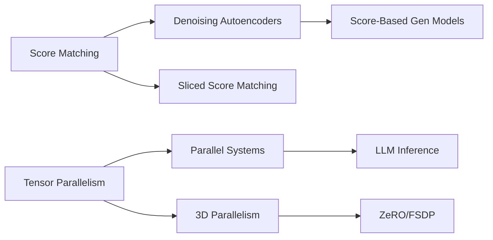

# Knowledge Graph

概念关系图——跨课程的知识关联。

## Concepts

### diffusion
- **Score Function** ([Hyvärinen 2005](diffusion/001-score-matching-hyvarinen-2005.md)) — Gradient of log-density; key concept for training unnormalized models
- **Score Matching** ([Hyvärinen 2005](diffusion/001-score-matching-hyvarinen-2005.md)) — Training objective that matches model score to data score
- **Denoising Autoencoder** ([Vincent 2011](diffusion/002-vincent-2011.md)) — Neural network that learns to reconstruct clean input from corrupted input
- **Denoising Score Matching** ([Vincent 2011](diffusion/002-vincent-2011.md)) — Equivalence between DAE reconstruction and score estimation
- **Tweedie's Formula** ([Vincent 2011](diffusion/002-vincent-2011.md)) — Statistical identity connecting posterior expectation and score

### llm-systems
- **Model Parallelism** ([Shoeybi 2019](systems/001-megatron-lm-shoeybi-2019.md)) — Splitting model parameters across GPUs within a single layer
- **Intra-layer Tensor Parallelism** ([Shoeybi 2019](systems/001-megatron-lm-shoeybi-2019.md)) — Column/row-wise partition of weight matrices
- **All-Reduce Communication** ([Shoeybi 2019](systems/001-megatron-lm-shoeybi-2019.md)) — Communication pattern at layer boundaries
- **Scaling Efficiency** ([Shoeybi 2019](systems/001-megatron-lm-shoeybi-2019.md)) — 76% efficiency on 512 GPUs for 8.3B parameter models

## Cross-Course Connections

- **Model Parallelism → Large-scale Training** — The scaling techniques pioneered in Megatron-LM (tensor parallelism) are prerequisites for training the massive diffusion models covered in the diffusion course, enabling multi-billion parameter vision models
- **All-Reduce → Distributed Systems** — The communication-efficient patterns established here underpin modern LLM serving systems (vLLM, SGLang) and their distributed inference architectures

