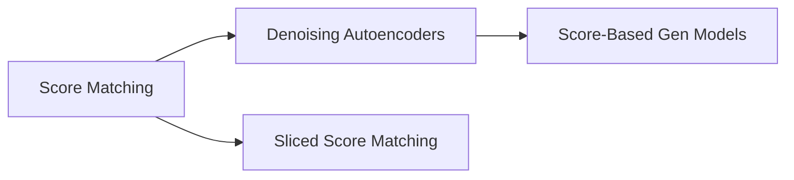

# Knowledge Graph

概念关系图——跨课程的知识关联。

## 概念索引

| 概念 | 相关课程 | 首次出现 |
|------|----------|----------|
| Score Matching | Diffusion | Hyvärinen (2005) |
| Denoising Autoencoders | Diffusion | Vincent (2011) |
