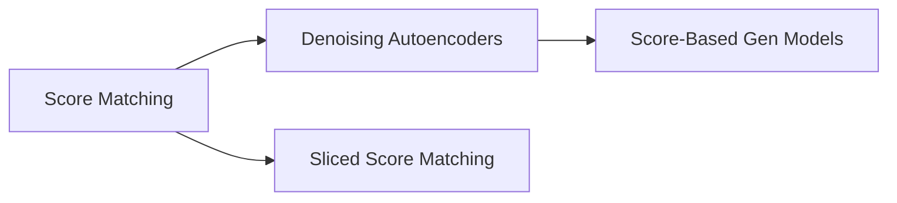

# Knowledge Graph

概念关系图——跨课程的知识关联。

## Concepts

### diffusion
- **Score Function** ([Hyvärinen 2005](diffusion/001-score-matching-hyvarinen-2005.md)) — Gradient of log-density; key concept for training unnormalized models
- **Score Matching** ([Hyvärinen 2005](diffusion/001-score-matching-hyvarinen-2005.md)) — Training objective that matches model score to data score
- **Denoising Autoencoder** ([Vincent 2011](diffusion/002-vincent-2011.md)) — Neural network that learns to reconstruct clean input from corrupted input
- **Denoising Score Matching** ([Vincent 2011](diffusion/002-vincent-2011.md)) — Equivalence between DAE reconstruction and score estimation
- **Tweedie's Formula** ([Vincent 2011](diffusion/002-vincent-2011.md)) — Statistical identity connecting posterior expectation and score

## Cross-Course Connections

*(Will be populated on Saturdays)*

